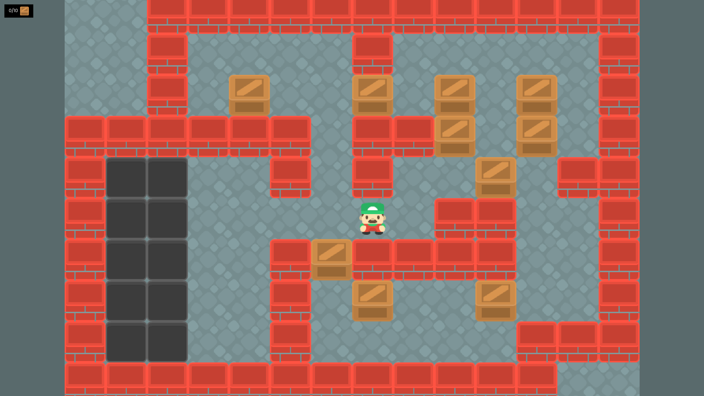

import { Kbd } from "starlight-kbd/components";

Sokoban is a puzzle game in which the player pushes boxes around in a warehouse, trying to get them to storage locations.[^1]

## Controls

- Move up: <Kbd windows="W" />
- Move left: <Kbd windows="A" />
- Move down: <Kbd windows="S" />
- Move right: <Kbd windows="D" />
- Undo move: <Kbd windows="Ctrl+Z" />
- Redo move: <Kbd windows="Ctrl+Shift+Z" />

[^1]: Source: [Sokoban - Wikipedia](https://en.wikipedia.org/wiki/Sokoban)